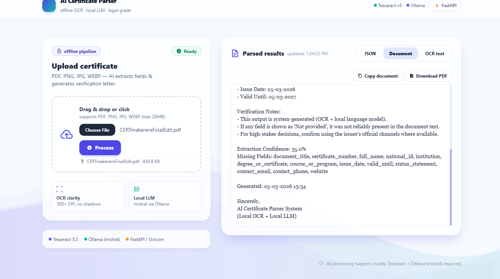
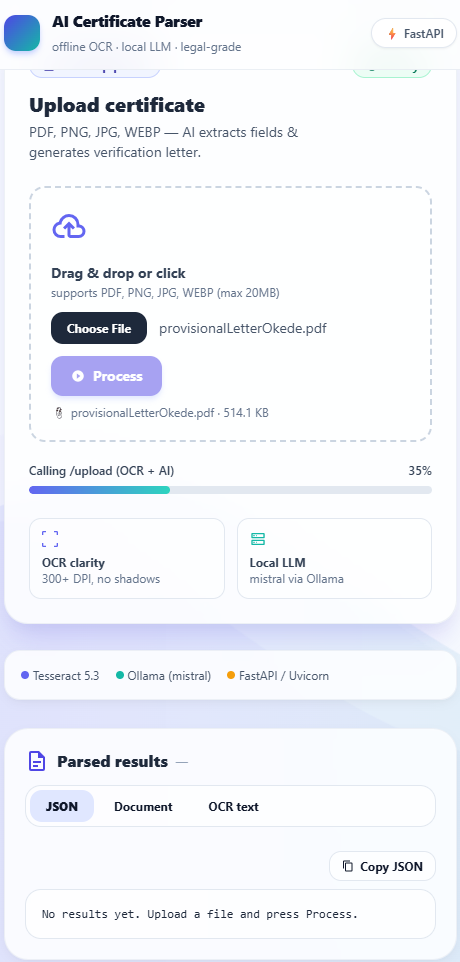
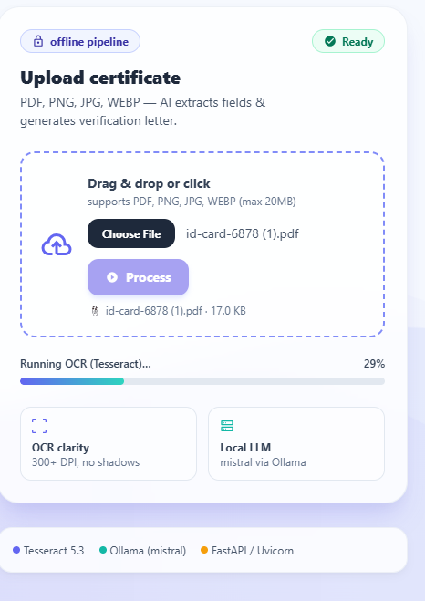
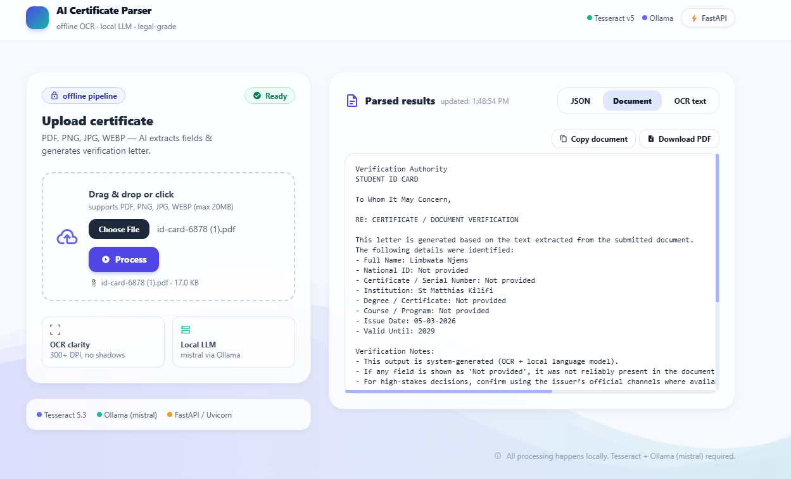
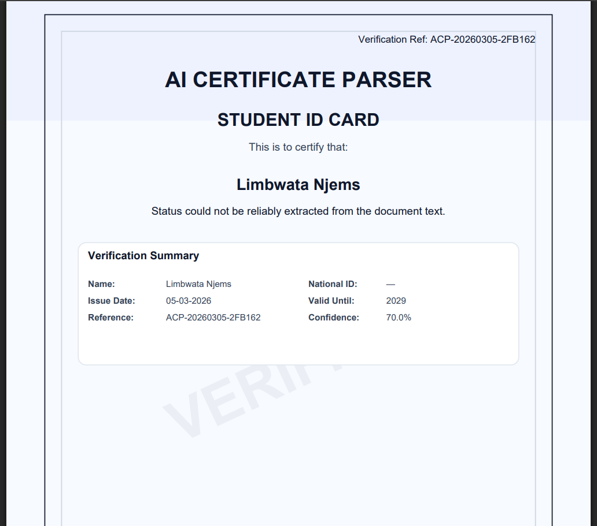

# AI Certificate Parser

Offline-first AI system that parses certificates and generates a verification letter + a styled verification PDF.

## Features

- Upload certificate (PDF / Image)
- OCR extraction using **Tesseract**
- Structured field extraction using a **local LLM via Ollama**
- Automatic **verification letter generation**
- Styled **verification PDF** download
- Clean **FastAPI backend**
- Modern **UI dashboard** with progress stages (OCR → LLM → PDF)

## Architecture

Upload → OCR → LLM Extraction → Structured JSON → Verification Letter → Verification PDF

## Tech Stack

- Python 3.12
- FastAPI + Uvicorn
- Tesseract OCR
- Ollama (Local LLM)
- pdfplumber
- ReportLab (PDF)

# Screenshots

## Dashboard Interface



---

## Compact Dashboard View



---

## OCR Extraction

Shows the raw text extracted from the uploaded document.



---

## AI Structured Extraction

The local LLM converts OCR text into structured fields.



---

## Generated Verification Certificate

The system automatically generates a styled verification PDF.



---

# Example Extracted Fields

The AI system extracts structured information such as:

- Full Name
- National ID
- Certificate Number
- Institution
- Degree / Qualification
- Course / Program
- Issue Date
- Valid Until
- Status statement

---

# Run Locally

Install dependencies:

```bash
pip install -r requirements.txt

Run the server:

uvicorn app:app --reload

Open the UI:

http://127.0.0.1:8000/ui
Project Pipeline

1️⃣ Upload certificate (PDF or image)
2️⃣ OCR extracts raw document text
3️⃣ Local LLM analyzes and extracts structured fields
4️⃣ System generates a verification letter
5️⃣ Styled verification PDF is produced

Notes

The system runs fully offline

No external AI APIs are required

Best results occur with high-quality document scans

License

MIT License